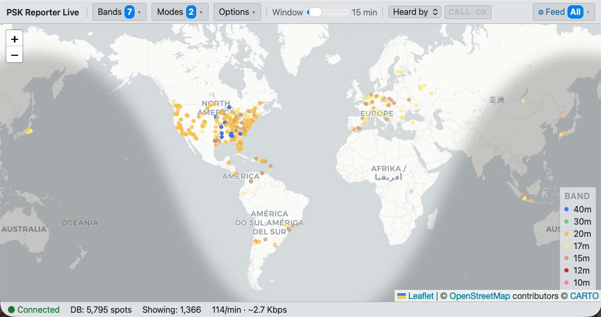
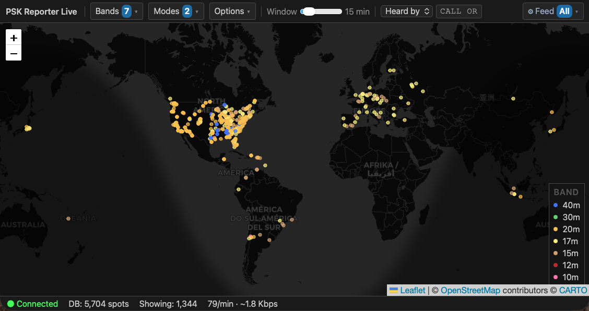
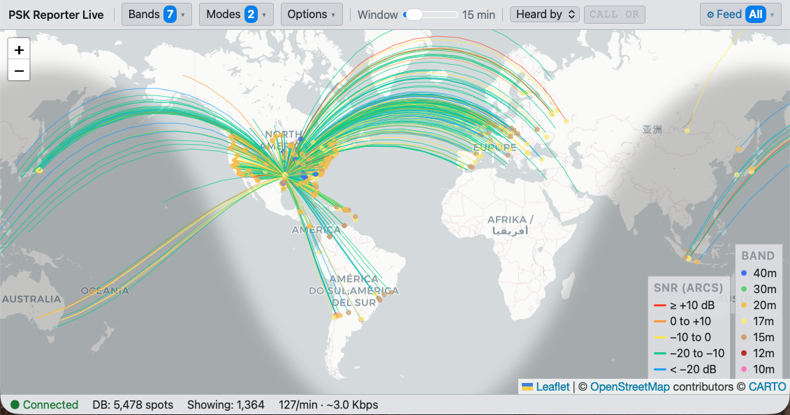

# pskr-map

**Light mode**


| Dark mode | Great-circle lines with SNR coloring |
|---|---|
|  |  |

A live web map of amateur radio propagation spots, driven by the
[PSK Reporter](https://pskreporter.info) MQTT feed.  Spots stream in
from the public broker in real time and are stored locally in SQLite so
you can change display filters and re-render the map instantly without
waiting for data to re-populate.

## How it works

```
PSK Reporter MQTT broker
  mqtt.pskreporter.info:1884 (TLS)
         │
         ▼
  Python backend (FastAPI + aiomqtt)
  ├── writes spots → SQLite  (rolling buffer, configurable TTL)
  └── pushes new spots → browser via WebSocket
         │
         ▼
  Browser (Leaflet map)
  ├── TX station dots, colored by band
  ├── optional great-circle arcs, colored by SNR
  └── display filters re-query SQLite instantly
```

By default the app connects directly to PSK Reporter's public broker.
Optionally, you can route the feed through a **local Mosquitto broker**
to fan it out across a LAN — see [docs/mosquitto-bridge.md](docs/mosquitto-bridge.md).

---

## Prerequisites

### Python

Python **3.11 or later** is required (uses `tomllib` from the standard
library and `asyncio.TaskGroup`).

Check your version:

```bash
python3 --version
```

On Debian/Ubuntu/Raspberry Pi OS:

```bash
sudo apt install python3.11 python3.11-venv
```

On macOS (Homebrew):

```bash
brew install python@3.11
```

### Python packages

The `run.sh` / `run.ps1` scripts create a virtual environment and install
everything automatically on first run.  To install manually:

```bash
python3 -m venv .venv
source .venv/bin/activate
pip install -r requirements.txt
```

| Package | Purpose |
|---|---|
| `fastapi` | HTTP + WebSocket server |
| `uvicorn[standard]` | ASGI server (runs FastAPI) |
| `aiomqtt` | Async MQTT client |
| `aiosqlite` | Async SQLite wrapper |
| `pydantic` | Spot schema validation |

### Network access

**Direct mode (default):** outbound TLS to `mqtt.pskreporter.info:1884`
must be permitted by your firewall.  Plain TCP on port `1883` and
WebSocket variants (`1885`, `1886`) are also available — see `config.toml`.

**Local broker mode:** no outbound access needed from pskr-map; the
Mosquitto bridge handles the upstream connection.  See
[docs/mosquitto-bridge.md](docs/mosquitto-bridge.md).

---

## Quick start

**macOS / Linux:**
```bash
git clone https://github.com/K5PTB/pskr-map.git
cd pskr-map
./run.sh
```

**Windows (PowerShell):**
```powershell
git clone https://github.com/K5PTB/pskr-map.git
cd pskr-map
.\run.ps1
```

Then open **http://localhost:8765** in a browser.

The startup script creates `.venv/` and installs dependencies on first run,
then starts uvicorn.  Subsequent runs skip the install step if
packages are already satisfied.

> **Windows note:** Python 3.11+ must be on your `PATH`.  Install from
> [python.org](https://www.python.org/downloads/) and check
> *"Add python.exe to PATH"* during setup.  If PowerShell blocks the
> script, run `Set-ExecutionPolicy -Scope CurrentUser RemoteSigned` once.

---

## Configuration

Edit **`config.toml`** before starting:

```toml
[broker]
host      = "mqtt.pskreporter.info"
port      = 1884          # 1883=plain TCP, 1884=TLS, 1885=WS, 1886=WSS
use_tls   = true

[database]
path        = "spots.db"
ttl_minutes = 60          # how long spots are kept in SQLite

[server]
host = "0.0.0.0"          # bind address (use 127.0.0.1 for local-only)
port = 8765

[defaults]
bands                   = ["40m", "20m", "15m"]
modes                   = ["FT8"]
display_max_age_minutes = 30
```

`broker` and `server` require a restart to take effect.  Everything
else can be changed at runtime via the browser UI, and those runtime
settings are persisted automatically across restarts.

---

## Usage

### The two-level filter model

pskr-map keeps two independent filters, which is the key to its
instant-replay behavior:

```
┌─────────────────────────────────────────────────────┐
│  FEED FILTER  (⚙ gear menu, top-right)              │
│  Controls which spots the MQTT broker sends us.     │
│  Changing this updates the MQTT subscription and    │
│  determines what gets stored in the SQLite buffer.  │
│  Think of it as your data collection net.           │
└───────────────────┬─────────────────────────────────┘
                    │  spots flow in → SQLite buffer
┌───────────────────▼─────────────────────────────────┐
│  DISPLAY FILTER  (top bar)                          │
│  Controls which stored spots appear on the map.     │
│  Changing this re-queries SQLite instantly —        │
│  no MQTT change, no waiting for new data.           │
│  Think of it as a view into the collected buffer.   │
└─────────────────────────────────────────────────────┘
```

**Example:** Set the feed to collect 80m–10m FT8 with a 60-minute
buffer.  Then use the display filter to explore 40m only, then 20m
only, then "heard by W1AW" — each change is instant because all those
spots are already in the buffer.

---

### Feed filter  (⚙ gear, top-right)

The feed filter determines what the server subscribes to on MQTT and
how long spots are retained.  Changes take effect immediately and are
**saved across server restarts** (`pskr_state.json`).

> **Recommended first step:** enter your 4-character home grid square
> in the **Grid/Call** field (e.g. `EM13`).  This limits the feed to
> spots where your grid appears on either end of the path — stations
> in your grid hearing others, and others hearing stations in your
> grid.  For most operators this is all that's relevant, and it cuts
> the incoming data rate dramatically compared to an unfiltered
> subscription.

> **Bandwidth note:** the status bar shows the incoming spot rate and
> an estimated data rate.  On a typical multi-band FT8 subscription
> this is around 500 Kbps.  Narrow the feed filter to reduce it.

| Control | What it does |
|---|---|
| **Bands** (feed) | Which bands the server subscribes to on MQTT. Spots on other bands are never received and not stored. Use **all** / **none** shortcuts to select quickly. |
| **Modes** (feed) | Which modes the server subscribes to. |
| **DB TTL** slider | How long spots are kept in SQLite (5–120 min). Spots older than this are pruned every 5 minutes. |
| **Grid/Call** | Narrow the MQTT subscription to a single callsign or 4-character grid square — see below. |

Setting a band or mode to **none** in the feed drops that subscription
entirely.  If you later re-enable a band you missed while it was off,
those spots are gone — the buffer only contains what was collected
while the subscription was active.

#### Grid/Call filter (feed-level)

The **Grid/Call** field narrows the MQTT subscription so the server only
*receives* spots involving a specific station or grid square.  This
operates at the broker level — non-matching traffic is never transmitted
to pskr-map at all, which makes a meaningful difference on a constrained
connection.  Everything the server does receive is stored normally and
available to all display filters.

Accepted values:

- **Exact callsign** (e.g. `K5PTB`) — broker delivers only spots where
  that callsign appears as the transmitter *or* the receiver.
- **4-character grid square** (e.g. `EM13`) — broker delivers only spots
  where that grid appears as the TX grid *or* the RX grid.

> **Note:** shorter grid prefixes (e.g. `EM`) are not supported here —
> MQTT topic wildcards match a complete topic segment, not a prefix
> within one.  For prefix filtering, use the display filter's
> Callsign / grid field instead.  The field border turns red if the
> value is not a recognised callsign or 4-character grid.

**Field operation — POTA on a phone tether**

When activating a [Parks on the Air](https://parksontheair.com) site
using your phone as a hotspot, every kilobit counts.  The Grid/Call
feed filter keeps pskr-map useful while barely touching your data plan:

- **Before the activation** — enter your 4-character grid square
  (e.g. `EM13`).  The server receives only spots where that grid appears
  on either end of the path, giving you a quick read on which bands are
  open into your operating location before you put out a call.

- **During the activation** — switch to your callsign (e.g. `K5PTB`).
  Now only spots involving your station arrive — hunters reporting you,
  and your own reported transmissions.  You can watch your signal reach
  new grids in real time at a fraction of the normal feed rate.

> **Tip:** pair this with *Sent by K5PTB* in the display filter while
> activating.  Dots appear at the hunters' grids, so you can watch your
> pile-up spread across the map as hunters log you.

---

### Display filter  (top bar)

The display filter queries the local SQLite buffer.  No MQTT
interaction occurs; changes are instant regardless of buffer size.
All display settings are **saved in your browser** (`localStorage`)
and restored on the next page load.

| Control | What it does |
|---|---|
| **Bands** | Which bands to show on the map. Must be a subset of what the feed is collecting — spots for bands outside the feed will not be in the buffer. Use **All** / **None** shortcuts. |
| **Modes** | Which modes to show. Same subset rule applies. |
| **Window** slider | How old a spot can be before it is removed from the map (5–120 min). Does not affect the SQLite buffer — only what is rendered. |
| **Monitors** / **Sent by** / **Heard by** | Controls what the dots represent — see below. |
| Callsign / grid field | Enter a callsign (e.g. `K5PTB`) for an exact match, or a Maidenhead grid prefix (e.g. `EM`, `EM13`, `EM13LB`) to match all stations in that grid area. |

#### View modes explained

The three modes control both *which spots* are shown and *where the dots are placed*.
The callsign/grid field acts as an optional filter in all three modes.

| Mode | Dot placed at | No callsign | With callsign |
|---|---|---|---|
| **Monitors** | RX grid | One dot per unique receiving station — a listener map | Restrict to receivers in a grid area or a single rx_call |
| **Sent by** | RX grid | All spots — dots show who is receiving | Dots show who heard that TX station |
| **Heard by** | TX grid | All spots — dots show who is transmitting | Dots show what that RX station heard |

> **Quick guide:** *Monitors* answers "where are the listening stations?"
> *Sent by K5PTB* answers "who heard K5PTB?"
> *Heard by K5PTB* answers "what did K5PTB hear?"

> **Display vs feed:** the display filter never changes what the server
> collects.  If you display only 20m but the feed is collecting 40m
> and 20m, 40m spots are silently buffered and will appear the moment
> you add 40m back to the display filter.

---

### Options  (Options menu, top bar)

| Option | What it does |
|---|---|
| **Great-circle lines** | Draw geodesic arcs from transmitter to receiver, colored by SNR. Off by default. When enabled, the SNR color legend appears next to the band legend. |
| **Dark mode** | Switch to a dark map tile and dark UI theme. |

---

### Map display

Each spot is drawn as a colored dot, with placement depending on the
selected view mode (see above).  Dots are colored by band:

| Color | Band | | Color | Band |
|---|---|---|---|---|
| 🟢 Lime green | 160m | | 🟡 Golden yellow | 20m |
| 🟣 Magenta | 80m | | 🌕 Yellow | 17m |
| 🔵 Dark navy | 60m | | 🟤 Tan | 15m |
| 💙 Blue | 40m | | 🔴 Dark red | 12m |
| 🍏 Green | 30m | | 🩷 Pink | 10m |
| 🔴 Red | 6m | | 💗 Hot pink | 2m |
| 🫒 Olive | 70cm | | | |

When **great-circle lines** are enabled, arcs are colored by SNR:

| Color | SNR |
|---|---|
| Red | ≥ +10 dB |
| Orange | 0 to +10 dB |
| Yellow | −10 to 0 dB |
| Teal | −20 to −10 dB |
| Blue | < −20 dB |

Hover over any dot or arc to see the full spot details (callsigns,
frequency, mode, SNR, band, and age).

---

### Status bar

The status bar at the bottom of the page shows (updated every second):

| Field | Meaning |
|---|---|
| **● Connected** / **○ Disconnected** | WebSocket connection to the backend |
| **DB: N spots** | Total spots currently in the SQLite buffer |
| **Showing: N** | Spots visible on the map after display filtering |
| **N/min · ~X Kbps** | Incoming MQTT spot rate and estimated bandwidth |

---

## LAN fan-out (optional)

If you already run a Mosquitto broker, you can bridge the PSK Reporter
feed into it once and have multiple pskr-map instances (or other tools)
subscribe locally.  No code changes — just point `config.toml` at your
local broker.

See **[docs/mosquitto-bridge.md](docs/mosquitto-bridge.md)** for the
complete bridge configuration and notes on CA bundle paths across
platforms.

---

## Deployment (VPS or Raspberry Pi)

A minimal systemd unit:

```ini
[Unit]
Description=PSK Reporter live map
After=network-online.target

[Service]
WorkingDirectory=/opt/pskr-map
ExecStart=/opt/pskr-map/.venv/bin/uvicorn backend.main:app --host 0.0.0.0 --port 8765
Restart=on-failure
RestartSec=10

[Install]
WantedBy=multi-user.target
```

Save to `/etc/systemd/system/pskr-map.service`, then:

```bash
sudo systemctl enable --now pskr-map
```

For HTTPS, put Nginx or Caddy in front and proxy `/` and `/ws` to
`localhost:8765`.

---

## License

[GNU Affero General Public License v3.0](LICENSE) (AGPL-3.0)

- Source must remain open
- Derivative works must be released under AGPL-3.0
- Network use (running as a service) counts as distribution — you must share any modifications
